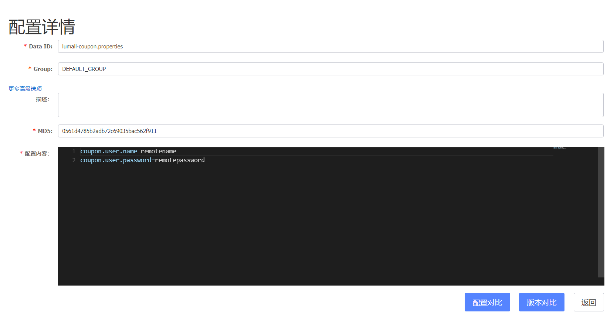
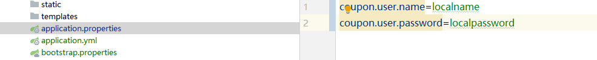
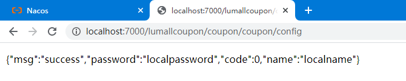
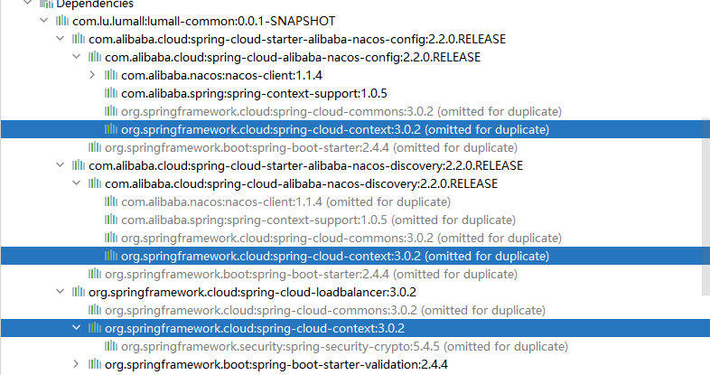
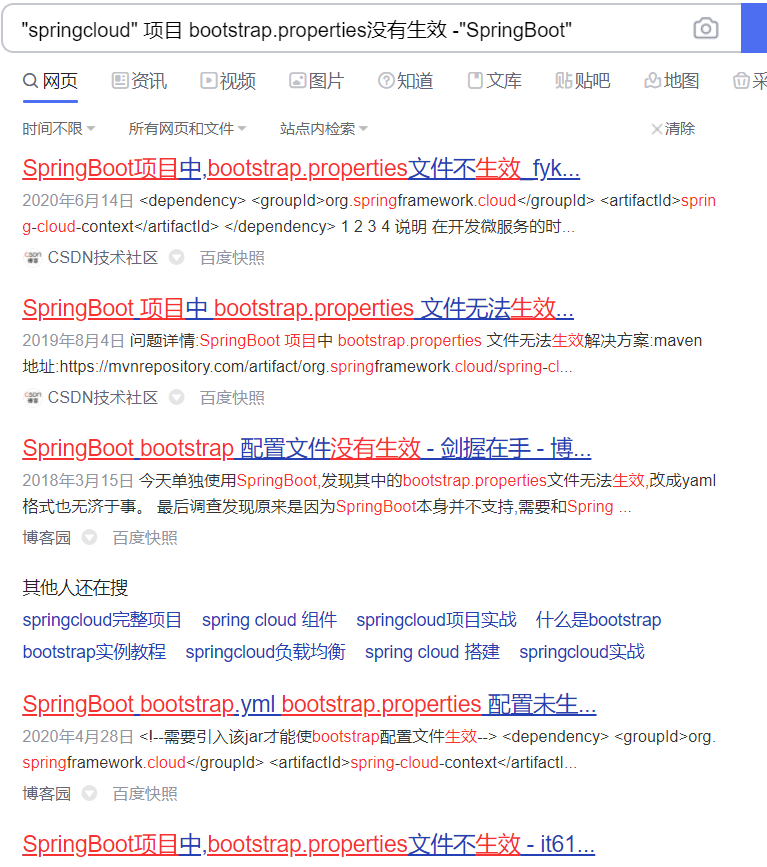
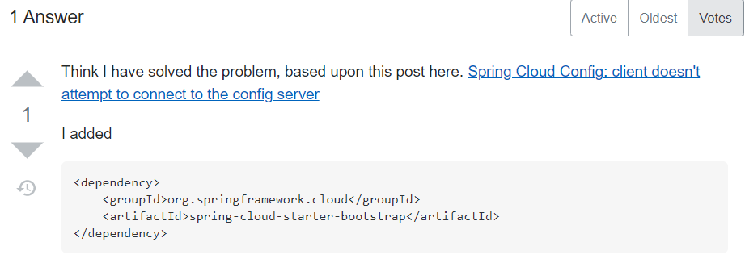
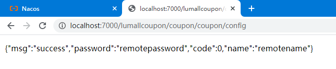
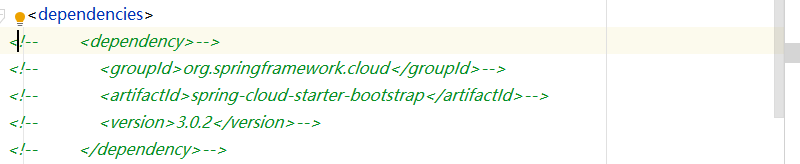
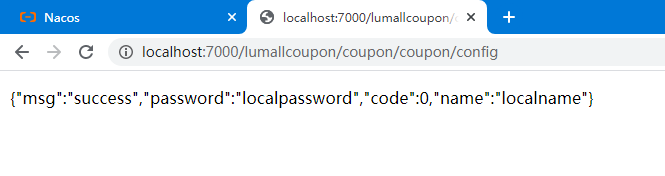

## Injection of autowired dependencies failed; nested exception is java.lang.IllegalArgumentException: Could not resolve placeholder 'coupon.user.name' in value "${coupon.user.name}"

### 配置完linux中nacos，使用以下两条命令都成功执行（说明nacos本身没问题，那就看代码）

```
curl -X POST "http://192.168.3.119:8848/nacos/v1/cs/configs?dataId=lumall-coupon.properties&group=DEFAULT_GROUP&content=coupon.user.name=haha%0Acoupon.user.password=004"
```

```
curl -X GET "http://192.168.3.119:8848/nacos/v1/cs/configs?dataId=lumall-coupon.properties&group=DEFAULT_GROUP"
```

#### 运行微服务出错如下

```
org.springframework.beans.factory.BeanCreationException: Error creating bean with name 'scopedTarget.couponController': Injection of autowired dependencies failed; nested exception is java.lang.IllegalArgumentException: Could not resolve placeholder 'coupon.user.name' in value "${coupon.user.name}"
	at org.springframework.beans.factory.annotation.AutowiredAnnotationBeanPostProcessor.postProcessProperties(AutowiredAnnotationBeanPostProcessor.java:405) ~[spring-beans-5.3.5.jar:5.3.5]
	at org.springframework.beans.factory.support.AbstractAutowireCapableBeanFactory.populateBean(AbstractAutowireCapableBeanFactory.java:1413) ~[spring-beans-5.3.5.jar:5.3.5]
	at org.springframework.beans.factory.support.AbstractAutowireCapableBeanFactory.doCreateBean(AbstractAutowireCapableBeanFactory.java:601) ~[spring-beans-5.3.5.jar:5.3.5]
	at org.springframework.beans.factory.support.AbstractAutowireCapableBeanFactory.createBean(AbstractAutowireCapableBeanFactory.java:524) ~[spring-beans-5.3.5.jar:5.3.5]
	at org.springframework.beans.factory.support.AbstractBeanFactory.lambda$doGetBean$1(AbstractBeanFactory.java:374) ~[spring-beans-5.3.5.jar:5.3.5]
	at org.springframework.cloud.context.scope.GenericScope$BeanLifecycleWrapper.getBean(GenericScope.java:376) ~[spring-cloud-context-3.0.2.jar:3.0.2]
	at org.springframework.cloud.context.scope.GenericScope.get(GenericScope.java:179) ~[spring-cloud-context-3.0.2.jar:3.0.2]
	at org.springframework.beans.factory.support.AbstractBeanFactory.doGetBean(AbstractBeanFactory.java:371) ~[spring-beans-5.3.5.jar:5.3.5]
	at org.springframework.beans.factory.support.AbstractBeanFactory.getBean(AbstractBeanFactory.java:208) ~[spring-beans-5.3.5.jar:5.3.5]
	at org.springframework.context.support.AbstractApplicationContext.getBean(AbstractApplicationContext.java:1154) ~[spring-context-5.3.5.jar:5.3.5]
	at org.springframework.cloud.context.scope.refresh.RefreshScope.eagerlyInitialize(RefreshScope.java:125) ~[spring-cloud-context-3.0.2.jar:3.0.2]
	at org.springframework.cloud.context.scope.refresh.RefreshScope.start(RefreshScope.java:117) ~[spring-cloud-context-3.0.2.jar:3.0.2]
	at org.springframework.cloud.context.scope.refresh.RefreshScope.onApplicationEvent(RefreshScope.java:112) ~[spring-cloud-context-3.0.2.jar:3.0.2]
	at org.springframework.cloud.context.scope.refresh.RefreshScope.onApplicationEvent(RefreshScope.java:67) ~[spring-cloud-context-3.0.2.jar:3.0.2]
	at org.springframework.context.event.SimpleApplicationEventMulticaster.doInvokeListener(SimpleApplicationEventMulticaster.java:176) ~[spring-context-5.3.5.jar:5.3.5]
	at org.springframework.context.event.SimpleApplicationEventMulticaster.invokeListener(SimpleApplicationEventMulticaster.java:169) ~[spring-context-5.3.5.jar:5.3.5]
	at org.springframework.context.event.SimpleApplicationEventMulticaster.multicastEvent(SimpleApplicationEventMulticaster.java:143) ~[spring-context-5.3.5.jar:5.3.5]
	at org.springframework.context.support.AbstractApplicationContext.publishEvent(AbstractApplicationContext.java:421) ~[spring-context-5.3.5.jar:5.3.5]
	at org.springframework.context.support.AbstractApplicationContext.publishEvent(AbstractApplicationContext.java:378) ~[spring-context-5.3.5.jar:5.3.5]
	at org.springframework.context.support.AbstractApplicationContext.finishRefresh(AbstractApplicationContext.java:938) ~[spring-context-5.3.5.jar:5.3.5]
	at org.springframework.context.support.AbstractApplicationContext.refresh(AbstractApplicationContext.java:586) ~[spring-context-5.3.5.jar:5.3.5]
	at org.springframework.boot.web.servlet.context.ServletWebServerApplicationContext.refresh(ServletWebServerApplicationContext.java:144) ~[spring-boot-2.4.4.jar:2.4.4]
	at org.springframework.boot.SpringApplication.refresh(SpringApplication.java:769) [spring-boot-2.4.4.jar:2.4.4]
	at org.springframework.boot.SpringApplication.refresh(SpringApplication.java:761) [spring-boot-2.4.4.jar:2.4.4]
	at org.springframework.boot.SpringApplication.refreshContext(SpringApplication.java:426) [spring-boot-2.4.4.jar:2.4.4]
	at org.springframework.boot.SpringApplication.run(SpringApplication.java:326) [spring-boot-2.4.4.jar:2.4.4]
	at org.springframework.boot.SpringApplication.run(SpringApplication.java:1313) [spring-boot-2.4.4.jar:2.4.4]
	at org.springframework.boot.SpringApplication.run(SpringApplication.java:1302) [spring-boot-2.4.4.jar:2.4.4]
	at com.lu.lumall.lumallcoupon.LumallCouponApplication.main(LumallCouponApplication.java:14) [classes/:na]
Caused by: java.lang.IllegalArgumentException: Could not resolve placeholder 'coupon.user.name' in value "${coupon.user.name}"
	at org.springframework.util.PropertyPlaceholderHelper.parseStringValue(PropertyPlaceholderHelper.java:178) ~[spring-core-5.3.5.jar:5.3.5]
	at org.springframework.util.PropertyPlaceholderHelper.replacePlaceholders(PropertyPlaceholderHelper.java:124) ~[spring-core-5.3.5.jar:5.3.5]
	at org.springframework.core.env.AbstractPropertyResolver.doResolvePlaceholders(AbstractPropertyResolver.java:239) ~[spring-core-5.3.5.jar:5.3.5]
	at org.springframework.core.env.AbstractPropertyResolver.resolveRequiredPlaceholders(AbstractPropertyResolver.java:210) ~[spring-core-5.3.5.jar:5.3.5]
	at org.springframework.context.support.PropertySourcesPlaceholderConfigurer.lambda$processProperties$0(PropertySourcesPlaceholderConfigurer.java:175) ~[spring-context-5.3.5.jar:5.3.5]
	at org.springframework.beans.factory.support.AbstractBeanFactory.resolveEmbeddedValue(AbstractBeanFactory.java:936) ~[spring-beans-5.3.5.jar:5.3.5]
	at org.springframework.beans.factory.support.DefaultListableBeanFactory.doResolveDependency(DefaultListableBeanFactory.java:1321) ~[spring-beans-5.3.5.jar:5.3.5]
	at org.springframework.beans.factory.support.DefaultListableBeanFactory.resolveDependency(DefaultListableBeanFactory.java:1300) ~[spring-beans-5.3.5.jar:5.3.5]
	at org.springframework.beans.factory.annotation.AutowiredAnnotationBeanPostProcessor$AutowiredFieldElement.resolveFieldValue(AutowiredAnnotationBeanPostProcessor.java:657) ~[spring-beans-5.3.5.jar:5.3.5]
	at org.springframework.beans.factory.annotation.AutowiredAnnotationBeanPostProcessor$AutowiredFieldElement.inject(AutowiredAnnotationBeanPostProcessor.java:640) ~[spring-beans-5.3.5.jar:5.3.5]
	at org.springframework.beans.factory.annotation.InjectionMetadata.inject(InjectionMetadata.java:119) ~[spring-beans-5.3.5.jar:5.3.5]
	at org.springframework.beans.factory.annotation.AutowiredAnnotationBeanPostProcessor.postProcessProperties(AutowiredAnnotationBeanPostProcessor.java:399) ~[spring-beans-5.3.5.jar:5.3.5]
	... 28 common frames omitted
```

### 解决思路：查看配置文件，以及代码

#### bootstrap.properties

```
spring.application.name=lumall-coupon
spring.cloud.nacos.config.server-addr=192.168.3.119:8848
```

#### application.yml

```
spring:
  datasource:
    url: jdbc:mysql://192.168.3.119:3306/gulimall_sms
    driver-class-name: com.mysql.jdbc.Driver
    username: root
    password: root
  cloud:
    nacos:
      discovery:
        server-addr: 192.168.3.119:8848
  application:
    name: lumall-coupon
mybatis-plus:
  mapper-locations: classpath:/mapper/**/*.xml
  global-config:
    db-config:
      id-type: auto
server:
  port: 7000
management:
  endpoints:
    web:
      exposure:
        include= *
```

#### CouponController

```
    @Value(value = "${coupon.user.name}")
    private String name;
    @Value(value = "${coupon.user.password}")
    private String password;

    @RequestMapping("/coupon/config")
    public R test001(){
        return R.ok().put("name",name).put("password",password);
    }
```

#### nacos网页配置




#### 经过一系列查看并没有发现已有代码的问题

#### 我试一下本地application.properties，coupon服务成功获取到值




#### 经过以上过程，继续分析：

1.nacos本身post，get没有问题；

2.代码读取本地properties也没有问题；

3.那就只有**bootstrap.properties**有问题，但是**bootstrap.properties**并没有问题；

4.结论：**bootstrap.properties**没有**生效**。

#### 查了一下，需要spring-cloud-context依赖，把此依赖添加到common模块pom.xml（ps：clean install）

```
        <dependency>
            <groupId>org.springframework.cloud</groupId>
            <artifactId>spring-cloud-context</artifactId>
            <version>2.0.1.RELEASE</version>
        </dependency>
```

#### 运行一下coupon服务，呵呵🙂，**bootstrap.properties**还是没用生效，删除spring-cloud-context😕



#### 我发现coupon已添加的依赖spring-cloud-starter-openfeign本来就含有spring-cloud-context，怎么办呢？


#### (⊙o⊙)？，这几个cloud里边都含有spring-cloud-context，🙂，这货还真不缺



#### 我继续搜🙂，全是一样的



#### 我换个方法搜😄，终于看到不一样的啦




#### 添加依赖到common的pom（ps: clean install）

```
<dependency>
    <groupId>org.springframework.cloud</groupId>
    <artifactId>spring-cloud-starter-bootstrap</artifactId>
</dependency>
```

#### 运行common服务，🤣🤣🤣，终于成功了，边找解决办法边写这篇笔记，用时5个小时



# 以下为官网说明及尝试

```
Spring Cloud Commons
The bootstrap phase is no longer enabled by default. If your project requires it, it can be re-enabled by properties or by a new starter. To re-enable by properties set spring.cloud.bootstrap.enabled=true or spring.config.use-legacy-processing=true. These need to be set as an environment variable, java system property or a command line argument. The other option is to include the new spring-cloud-starter-bootstrap. Bootstrap is mostly used to import configuration from remote sources. To do this without boostrap see the new features in Config, Consul, Vault and Zookeeper.
```


#### common的pom.xml注掉spring-cloud-starter-bootstrap，尝试配置文件



#### coupon的bootstrap.properties添加spring.cloud.bootstrap.enabled=true


#### 运行coupon服务，🙂，未完待续...

