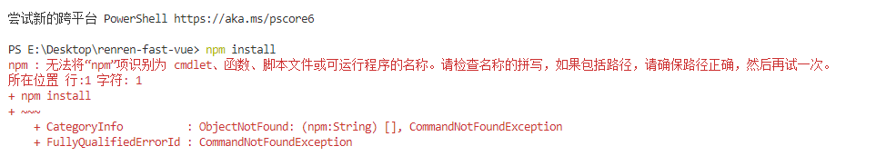

## vs终端输入npm install出现错误

### 我首先做的两件事

1. #### 直接cmd，输入

   ```
   npm config set registry http://registry.npm.taobao.org/
   ```

2. #### 然后，项目目录打开终端，或者vscode中打开终端

   ```
   npm install
   ```

   #### 出现以下错误



```
npm : 无法将“npm”项识别为 cmdlet、函数、脚本文件或可运行程序的名称。请检查名称的拼写，如果包括路径，请确保路径正确，然后再试一次。
所在位置 行:1 字符: 1
+ npm install
```

### 重新安装nodejs，不设置淘宝镜像，重启电脑，npm install依然报错

```
Windows PowerShell
版权所有 (C) Microsoft Corporation。保留所有权利。

尝试新的跨平台 PowerShell https://aka.ms/pscore6

PS E:\Desktop\renren-fast-vue> npm install
npm WARN deprecated request@2.88.2: request has been deprecated, see https://github.com/request/request/issues/3142
npm WARN deprecated har-validator@5.1.5: this library is no longer supported

> node-sass@4.13.1 install E:\Desktop\renren-fast-vue\node_modules\node-sass
> node scripts/install.js

Downloading binary from https://github.com/sass/node-sass/releases/download/v4.13.1/win32-x64-83_binding.node
Cannot download "https://github.com/sass/node-sass/releases/download/v4.13.1/win32-x64-83_binding.node": 

HTTP error 404 Not Found

Hint: If github.com is not accessible in your location
      try setting a proxy via HTTP_PROXY, e.g. 

      export HTTP_PROXY=http://example.com:1234

or configure npm proxy via

      npm config set proxy http://example.com:8080

> node-sass@4.13.1 postinstall E:\Desktop\renren-fast-vue\node_modules\node-sass
> node scripts/build.js

Building: D:\nodejs\node.exe E:\Desktop\renren-fast-vue\node_modules\node-gyp\bin\node-gyp.js rebuild --verbose --libsass_ext= --libsass_cflags= --libsass_ldflags= --libsass_library=
gyp info it worked if it ends with ok
gyp verb cli [
gyp verb cli   'D:\\nodejs\\node.exe',
gyp verb cli   'E:\\Desktop\\renren-fast-vue\\node_modules\\node-gyp\\bin\\node-gyp.js',
gyp verb cli   'rebuild',
gyp verb cli   '--verbose',
gyp verb cli   '--libsass_ext=',
gyp verb cli   '--libsass_cflags=',
gyp verb cli   '--libsass_ldflags=',
gyp verb cli   '--libsass_library='
gyp verb cli ]
gyp info using node-gyp@3.8.0
gyp info using node@14.16.1 | win32 | x64
gyp verb command rebuild []
gyp verb command clean []
gyp verb clean removing "build" directory
gyp verb command configure []
gyp verb check python checking for Python executable "python2" in the PATH
gyp verb `which` failed Error: not found: python2
gyp verb `which` failed     at getNotFoundError (E:\Desktop\renren-fast-vue\node_modules\which\which.js:13:12)
gyp verb `which` failed     at F (E:\Desktop\renren-fast-vue\node_modules\which\which.js:68:19)
gyp verb `which` failed     at E (E:\Desktop\renren-fast-vue\node_modules\which\which.js:80:29)
gyp verb `which` failed     at E:\Desktop\renren-fast-vue\node_modules\which\which.js:89:16
gyp verb `which` failed     at E:\Desktop\renren-fast-vue\node_modules\isexe\index.js:42:5
gyp verb `which` failed     at E:\Desktop\renren-fast-vue\node_modules\isexe\windows.js:36:5
gyp verb `which` failed     at FSReqCallback.oncomplete (fs.js:183:21)
gyp verb `which` failed  python2 Error: not found: python2
gyp verb `which` failed     at getNotFoundError (E:\Desktop\renren-fast-vue\node_modules\which\which.js:13:12)
gyp verb `which` failed     at F (E:\Desktop\renren-fast-vue\node_modules\which\which.js:68:19)
gyp verb `which` failed     at E (E:\Desktop\renren-fast-vue\node_modules\which\which.js:80:29)
gyp verb `which` failed     at E:\Desktop\renren-fast-vue\node_modules\which\which.js:89:16
gyp verb `which` failed     at E:\Desktop\renren-fast-vue\node_modules\isexe\index.js:42:5
gyp verb `which` failed     at E:\Desktop\renren-fast-vue\node_modules\isexe\windows.js:36:5
gyp verb `which` failed     at FSReqCallback.oncomplete (fs.js:183:21) {
gyp verb `which` failed   code: 'ENOENT'
gyp verb `which` failed }
gyp verb check python checking for Python executable "python" in the PATH
gyp verb `which` succeeded python D:\python\python.EXE
gyp ERR! configure error
gyp ERR! stack Error: Command failed: D:\python\python.EXE -c import sys; print "%s.%s.%s" % sys.version_info[:3];
gyp ERR! stack   File "<string>", line 1
gyp ERR! stack     import sys; print "%s.%s.%s" % sys.version_info[:3];
gyp ERR! stack                       ^
gyp ERR! stack SyntaxError: invalid syntax
gyp ERR! stack
gyp ERR! stack     at ChildProcess.exithandler (child_process.js:308:12)
gyp ERR! stack     at ChildProcess.emit (events.js:315:20)
gyp ERR! stack     at maybeClose (internal/child_process.js:1048:16)
gyp ERR! stack     at Process.ChildProcess._handle.onexit (internal/child_process.js:288:5)
gyp ERR! System Windows_NT 10.0.19042
gyp ERR! command "D:\\nodejs\\node.exe" "E:\\Desktop\\renren-fast-vue\\node_modules\\node-gyp\\bin\\node-gyp.js" "rebuild" "--verbose" "--libsass_ext=" "--libsass_cflags=" "--libsass_ldflags=" "--libsass_library="
gyp ERR! cwd E:\Desktop\renren-fast-vue\node_modules\node-sass
gyp ERR! node -v v14.16.1
gyp ERR! node-gyp -v v3.8.0
gyp ERR! not ok
Build failed with error code: 1
npm WARN optional SKIPPING OPTIONAL DEPENDENCY: fsevents@1.2.9 (node_modules\fsevents):
npm WARN notsup SKIPPING OPTIONAL DEPENDENCY: Unsupported platform for fsevents@1.2.9: wanted {"os":"darwin","arch":"any"} (current: {"os":"win32","arch":"x64"})

npm ERR! code ELIFECYCLE
npm ERR! errno 1
npm ERR! node-sass@4.13.1 postinstall: `node scripts/build.js`
npm ERR! Exit status 1
npm ERR!
npm ERR! Failed at the node-sass@4.13.1 postinstall script.
npm ERR! This is probably not a problem with npm. There is likely additional logging output above.

npm ERR! A complete log of this run can be found in:
npm ERR!     E:\nodejs\npm_cache\_logs\2021-04-21T15_10_10_896Z-debug.log
PS E:\Desktop\renren-fast-vue>
```

## 执行以下,成功运行项目

- #### 清理缓存

```
npm rebuild node-sass
```

```
npm uninstall node-sass
```

- #### 设置镜像

```
npm config set registry http://registry.npm.taobao.org/
```

```
npm i node-sass --sass_binary_site=https://npm.taobao.org/mirrors/node-sass/
```

```
npm install
```

```
npm run dev
```


#### 以下为全部试错过程

```
Windows PowerShell
版权所有 (C) Microsoft Corporation。保留所有权利。

尝试新的跨平台 PowerShell https://aka.ms/pscore6

PS E:\Desktop\renren-fast-vue> npm install
npm WARN deprecated request@2.88.2: request has been deprecated, see https://github.com/request/request/issues/3142
npm WARN deprecated har-validator@5.1.5: this library is no longer supported

> node-sass@4.13.1 install E:\Desktop\renren-fast-vue\node_modules\node-sass
> node scripts/install.js

Downloading binary from https://github.com/sass/node-sass/releases/download/v4.13.1/win32-x64-83_binding.node
Cannot download "https://github.com/sass/node-sass/releases/download/v4.13.1/win32-x64-83_binding.node": 

ESOCKETTIMEDOUT

Hint: If github.com is not accessible in your location
      try setting a proxy via HTTP_PROXY, e.g.

      export HTTP_PROXY=http://example.com:1234

or configure npm proxy via

      npm config set proxy http://example.com:8080

> node-sass@4.13.1 postinstall E:\Desktop\renren-fast-vue\node_modules\node-sass
> node scripts/build.js

Building: D:\nodejs\node.exe E:\Desktop\renren-fast-vue\node_modules\node-gyp\bin\node-gyp.js rebuild --verbose --libsass_ext= --libsass_cflags= --libsass_ldflags= --libsass_library=
gyp info it worked if it ends with ok
gyp verb cli [
gyp verb cli   'D:\\nodejs\\node.exe',
gyp verb cli   'E:\\Desktop\\renren-fast-vue\\node_modules\\node-gyp\\bin\\node-gyp.js',
gyp verb cli   'rebuild',
gyp verb cli   '--verbose',
gyp verb cli   '--libsass_ext=',
gyp verb cli   '--libsass_cflags=',
gyp verb cli   '--libsass_ldflags=',
gyp verb cli   '--libsass_library='
gyp verb cli ]
gyp info using node-gyp@3.8.0
gyp info using node@14.16.1 | win32 | x64
gyp verb command rebuild []
gyp verb command clean []
gyp verb clean removing "build" directory
gyp verb command configure []
gyp verb check python checking for Python executable "python2" in the PATH
gyp verb `which` failed Error: not found: python2
gyp verb `which` failed     at getNotFoundError (E:\Desktop\renren-fast-vue\node_modules\which\which.js:13:12)
gyp verb `which` failed     at F (E:\Desktop\renren-fast-vue\node_modules\which\which.js:68:19)
gyp verb `which` failed     at E (E:\Desktop\renren-fast-vue\node_modules\which\which.js:80:29)
gyp verb `which` failed     at E:\Desktop\renren-fast-vue\node_modules\which\which.js:89:16
gyp verb `which` failed     at E:\Desktop\renren-fast-vue\node_modules\isexe\index.js:42:5
gyp verb `which` failed     at E:\Desktop\renren-fast-vue\node_modules\isexe\windows.js:36:5
gyp verb `which` failed     at FSReqCallback.oncomplete (fs.js:183:21)
gyp verb `which` failed  python2 Error: not found: python2
gyp verb `which` failed     at getNotFoundError (E:\Desktop\renren-fast-vue\node_modules\which\which.js:13:12)
gyp verb `which` failed     at F (E:\Desktop\renren-fast-vue\node_modules\which\which.js:68:19)
gyp verb `which` failed     at E (E:\Desktop\renren-fast-vue\node_modules\which\which.js:80:29)
gyp verb `which` failed     at E:\Desktop\renren-fast-vue\node_modules\which\which.js:89:16
gyp verb `which` failed     at E:\Desktop\renren-fast-vue\node_modules\isexe\index.js:42:5
gyp verb `which` failed     at E:\Desktop\renren-fast-vue\node_modules\isexe\windows.js:36:5
gyp verb `which` failed     at FSReqCallback.oncomplete (fs.js:183:21) {
gyp verb `which` failed   code: 'ENOENT'
gyp verb `which` failed }
gyp verb check python checking for Python executable "python" in the PATH
gyp verb `which` succeeded python D:\python\python.EXE
gyp ERR! configure error 
gyp ERR! stack Error: Command failed: D:\python\python.EXE -c import sys; print "%s.%s.%s" % sys.version_info[:3];
gyp ERR! stack   File "<string>", line 1
gyp ERR! stack     import sys; print "%s.%s.%s" % sys.version_info[:3];
gyp ERR! stack                       ^
gyp ERR! stack SyntaxError: invalid syntax
gyp ERR! stack     at ChildProcess.emit (events.js:315:20)
gyp ERR! stack     at maybeClose (internal/child_process.js:1048:16)
gyp ERR! stack     at Process.ChildProcess._handle.onexit (internal/child_process.js:288:5)
gyp ERR! System Windows_NT 10.0.19042
gyp ERR! command "D:\\nodejs\\node.exe" "E:\\Desktop\\renren-fast-vue\\node_modules\\node-gyp\\bin\\node-gyp.js" "rebuild" "--verbose" "--libsass_ext=" "--libsass_cflags=" "--libsass_ldflags=" "--libsass_library="
gyp ERR! cwd E:\Desktop\renren-fast-vue\node_modules\node-sass
gyp ERR! node -v v14.16.1
gyp ERR! node-gyp -v v3.8.0
Build failed with error code: 1
npm WARN optional SKIPPING OPTIONAL DEPENDENCY: fsevents@1.2.9 (node_modules\fsevents):
npm WARN notsup SKIPPING OPTIONAL DEPENDENCY: Unsupported platform for fsevents@1.2.9: wanted {"os":"darwin","arch":"any"} (current: {"os":"win32","arch":"x64"})

npm ERR! code ELIFECYCLE
npm ERR! errno 1
npm ERR! node-sass@4.13.1 postinstall: `node scripts/build.js`
npm ERR! Exit status 1
npm ERR!
npm ERR! Failed at the node-sass@4.13.1 postinstall script.
npm ERR! This is probably not a problem with npm. There is likely additional logging output above.

npm ERR! A complete log of this run can be found in:
npm ERR!     E:\nodejs\npm_cache\_logs\2021-04-21T15_21_52_840Z-debug.log
PS E:\Desktop\renren-fast-vue> npm rebuild node-sass
PS E:\Desktop\renren-fast-vue> npm uninstall node-sass
npm WARN deprecated request@2.88.2: request has been deprecated, see https://github.com/request/request/issues/3142
npm WARN deprecated har-validator@5.1.5: this library is no longer supported
npm WARN rollback Rolling back node-pre-gyp@0.12.0 failed (this is probably harmless): EPERM: operation not permitted, rmdir 'E:\Desktop\renren-fast-vue\node_modules\fsevents\node_modules'
npm WARN ajv-keywords@1.5.1 requires a peer of ajv@>=4.10.0 but none is installed. You must install peer dependencies yourself.
npm WARN sass-loader@6.0.6 requires a peer of node-sass@^4.0.0 but none is installed. You must install peer dependencies yourself.
npm WARN optional SKIPPING OPTIONAL DEPENDENCY: fsevents@1.2.9 (node_modules\fsevents):
npm WARN notsup SKIPPING OPTIONAL DEPENDENCY: Unsupported platform for fsevents@1.2.9: wanted {"os":"darwin","arch":"any"} (current: {"os":"win32","arch":"x64"})

up to date in 28.992s
PS E:\Desktop\renren-fast-vue> npm i node-sass --sass_binary_site=https://npm.taobao.org/mirrors/node-sass/
npm WARN deprecated request@2.88.2: request has been deprecated, see https://github.com/request/request/issues/3142

> node-sass@5.0.0 install E:\Desktop\renren-fast-vue\node_modules\node-sass
> node scripts/install.js

Downloading binary from https://npm.taobao.org/mirrors/node-sass//v5.0.0/win32-x64-83_binding.node
Download complete..] - :
Binary saved to E:\Desktop\renren-fast-vue\node_modules\node-sass\vendor\win32-x64-83\binding.node
Caching binary to E:\nodejs\npm_cache\node-sass\5.0.0\win32-x64-83_binding.node

> node-sass@5.0.0 postinstall E:\Desktop\renren-fast-vue\node_modules\node-sass
> node scripts/build.js

Binary found at E:\Desktop\renren-fast-vue\node_modules\node-sass\vendor\win32-x64-83\binding.node
Testing binary
Binary is fine
npm WARN sass-loader@6.0.6 requires a peer of node-sass@^4.0.0 but none is installed. You must install peer dependencies yourself.
npm WARN optional SKIPPING OPTIONAL DEPENDENCY: fsevents@1.2.9 (node_modules\fsevents):
npm WARN notsup SKIPPING OPTIONAL DEPENDENCY: Unsupported platform for fsevents@1.2.9: wanted {"os":"darwin","arch":"any"} (current: {"os":"win32","arch":"x64"})

+ node-sass@5.0.0
added 88 packages from 83 contributors in 48.396s

15 packages are looking for funding
  run `npm fund` for details

PS E:\Desktop\renren-fast-vue> npm run dev

> renren-fast-vue@1.2.2 dev E:\Desktop\renren-fast-vue
> webpack-dev-server --inline --progress --config build/webpack.dev.conf.js

 10% building modules 7/11 modules 4 active ...:\Desktop\renren-fast-vue\src\main.js(node:16228) Warning: Accessing non-existent property 'cat' of module exports inside circular dependency
(Use `node --trace-warnings ...` to show where the warning was created)
(node:16228) Warning: Accessing non-existent property 'cd' of module exports inside circular dependency
(node:16228) Warning: Accessing non-existent property 'chmod' of module exports inside circular dependency
(node:16228) Warning: Accessing non-existent property 'cp' of module exports inside circular dependency
(node:16228) Warning: Accessing non-existent property 'dirs' of module exports inside circular dependency
(node:16228) Warning: Accessing non-existent property 'pushd' of module exports inside circular dependency
(node:16228) Warning: Accessing non-existent property 'popd' of module exports inside circular dependency
(node:16228) Warning: Accessing non-existent property 'echo' of module exports inside circular dependency
(node:16228) Warning: Accessing non-existent property 'tempdir' of module exports inside circular dependency
(node:16228) Warning: Accessing non-existent property 'pwd' of module exports inside circular dependency
(node:16228) Warning: Accessing non-existent property 'exec' of module exports inside circular dependency
(node:16228) Warning: Accessing non-existent property 'ls' of module exports inside circular dependency
(node:16228) Warning: Accessing non-existent property 'find' of module exports inside circular dependency
(node:16228) Warning: Accessing non-existent property 'grep' of module exports inside circular dependency
(node:16228) Warning: Accessing non-existent property 'head' of module exports inside circular dependency
(node:16228) Warning: Accessing non-existent property 'ln' of module exports inside circular dependency
(node:16228) Warning: Accessing non-existent property 'mkdir' of module exports inside circular dependency
(node:16228) Warning: Accessing non-existent property 'rm' of module exports inside circular dependency
(node:16228) Warning: Accessing non-existent property 'mv' of module exports inside circular dependency
(node:16228) Warning: Accessing non-existent property 'sed' of module exports inside circular dependency
(node:16228) Warning: Accessing non-existent property 'set' of module exports inside circular dependency
(node:16228) Warning: Accessing non-existent property 'sort' of module exports inside circular dependency
(node:16228) Warning: Accessing non-existent property 'tail' of module exports inside circular dependency
(node:16228) Warning: Accessing non-existent property 'test' of module exports inside circular dependency
(node:16228) Warning: Accessing non-existent property 'to' of module exports inside circular dependency
(node:16228) Warning: Accessing non-existent property 'toEnd' of module exports inside circular dependency
(node:16228) Warning: Accessing non-existent property 'touch' of module exports inside circular dependency
(node:16228) Warning: Accessing non-existent property 'uniq' of module exports inside circular dependency
(node:16228) Warning: Accessing non-existent property 'which' of module exports inside circular dependency
 54% building modules 375/413 modules 38 active ...odules\job\schedule-add-or-update.vueNo parser and no filepath given, using 'babel' the parser now but this will throw an error in the future. Please specify a 
parser or a filepath so one can be inferred.
 55% building modules 376/413 modules 37 active ...odules\job\schedule-add-or-update.vueNo parser and no filepath given, using 'babel' the parser now but this will throw an error in the future. Please specify a 
parser or a filepath so one can be inferred.
 55% building modules 377/413 modules 36 active ...odules\job\schedule-add-or-update.vueNo parser and no filepath given, using 'babel' the parser now but this will throw an error in the future. Please specify a 
parser or a filepath so one can be inferred.
 55% building modules 378/413 modules 35 active ...odules\job\schedule-add-or-update.vueNo parser and no filepath given, using 'babel' the parser now but this will throw an error in the future. Please specify a 
parser or a filepath so one can be inferred.
 55% building modules 379/413 modules 34 active ...odules\job\schedule-add-or-update.vueNo parser and no filepath given, using 'babel' the parser now but this will throw an error in the future. Please specify a 
parser or a filepath so one can be inferred.
 55% building modules 380/413 modules 33 active ...odules\job\schedule-add-or-update.vueNo parser and no filepath given, using 'babel' the parser now but this will throw an error in the future. Please specify a 
parser or a filepath so one can be inferred.
 55% building modules 381/413 modules 32 active ...odules\job\schedule-add-or-update.vueNo parser and no filepath given, using 'babel' the parser now but this will throw an error in the future. Please specify a 
parser or a filepath so one can be inferred.
 55% building modules 382/413 modules 31 active ...odules\job\schedule-add-or-update.vueNo parser and no filepath given, using 'babel' the parser now but this will throw an error in the future. Please specify a 
parser or a filepath so one can be inferred.
 55% building modules 383/413 modules 30 active ...odules\job\schedule-add-or-update.vueNo parser and no filepath given, using 'babel' the parser now but this will throw an error in the future. Please specify a 
parser or a filepath so one can be inferred.
 56% building modules 384/413 modules 29 active ...odules\job\schedule-add-or-update.vueNo parser and no filepath given, using 'babel' the parser now but this will throw an error in the future. Please specify a 
parser or a filepath so one can be inferred.
 56% building modules 385/413 modules 28 active ...odules\job\schedule-add-or-update.vueNo parser and no filepath given, using 'babel' the parser now but this will throw an error in the future. Please specify a 
parser or a filepath so one can be inferred.
 56% building modules 386/414 modules 28 active ...rc\views\modules\job\schedule-log.vueNo parser and no filepath given, using 'babel' the parser now but this will throw an error in the future. Please specify a 
parser or a filepath so one can be inferred.
 56% building modules 387/415 modules 28 active ...ue\src\views\modules\job\schedule.vueNo parser and no filepath given, using 'babel' the parser now but this will throw an error in the future. Please specify a 
parser or a filepath so one can be inferred.
 56% building modules 388/416 modules 28 active ...ast-vue\src\views\modules\oss\oss.vueNo parser and no filepath given, using 'babel' the parser now but this will throw an error in the future. Please specify a 
parser or a filepath so one can be inferred.
 56% building modules 391/420 modules 29 active ...\src\views\modules\oss\oss-config.vueNo parser and no filepath given, using 'babel' the parser now but this will throw an error in the future. Please specify a 
parser or a filepath so one can be inferred.
 57% building modules 395/423 modules 28 active ...\src\views\modules\oss\oss-upload.vueNo parser and no filepath given, using 'babel' the parser now but this will throw an error in the future. Please specify a 
parser or a filepath so one can be inferred.
 57% building modules 397/426 modules 29 active ...ws\modules\sys\role-add-or-update.vueNo parser and no filepath given, using 'babel' the parser now but this will throw an error in the future. Please specify a 
parser or a filepath so one can be inferred.
 57% building modules 399/428 modules 29 active ...st-vue\src\views\modules\sys\user.vueNo parser and no filepath given, using 'babel' the parser now but this will throw an error in the future. Please specify a 
parser or a filepath so one can be inferred.
 58% building modules 401/429 modules 28 active ...ws\modules\sys\user-add-or-update.vueNo parser and no filepath given, using 'babel' the parser now but this will throw an error in the future. Please specify a 
parser or a filepath so one can be inferred.
 58% building modules 406/435 modules 29 active ...st-vue\src\views\modules\sys\role.vueNo parser and no filepath given, using 'babel' the parser now but this will throw an error in the future. Please specify a 
parser or a filepath so one can be inferred.
 59% building modules 414/448 modules 34 active ...views\main-navbar-update-password.vueNo parser and no filepath given, using 'babel' the parser now but this will throw an error in the future. Please specify a 
parser or a filepath so one can be inferred.
 60% building modules 417/450 modules 33 active ...n-fast-vue\src\views\main-content.vueNo parser and no filepath given, using 'babel' the parser now but this will throw an error in the future. Please specify a 
parser or a filepath so one can be inferred.
 61% building modules 427/455 modules 28 active ...n-fast-vue\src\views\common\login.vueNo parser and no filepath given, using 'babel' the parser now but this will throw an error in the future. Please specify a 
parser or a filepath so one can be inferred.
 61% building modules 431/457 modules 26 active ...ren-fast-vue\src\views\common\404.vueNo parser and no filepath given, using 'babel' the parser now but this will throw an error in the future. Please specify a 
parser or a filepath so one can be inferred.
 62% building modules 438/465 modules 27 active ...en-fast-vue\src\views\common\home.vueNo parser and no filepath given, using 'babel' the parser now but this will throw an error in the future. Please specify a 
parser or a filepath so one can be inferred.
 62% building modules 441/468 modules 27 active ...n-fast-vue\src\views\demo\echarts.vueNo parser and no filepath given, using 'babel' the parser now but this will throw an error in the future. Please specify a 
parser or a filepath so one can be inferred.
 63% building modules 444/473 modules 29 active ...n-fast-vue\src\views\common\theme.vueNo parser and no filepath given, using 'babel' the parser now but this will throw an error in the future. Please specify a 
parser or a filepath so one can be inferred.
 63% building modules 446/476 modules 30 active ...n-fast-vue\src\views\demo\ueditor.vueNo parser and no filepath given, using 'babel' the parser now but this will throw an error in the future. Please specify a 
parser or a filepath so one can be inferred.
 64% building modules 458/489 modules 31 active ...:\Desktop\renren-fast-vue\src\App.vueNo parser and no filepath given, using 'babel' the parser now but this will throw an error in the future. Please specify a 
parser or a filepath so one can be inferred.
 95% emitting

 DONE  Compiled successfully in 31379ms                                                                                                                                                                  下午11:26:43

 I  Your application is running here: http://localhost:8001
终止批处理操作吗(Y/N)? 
^C
PS E:\Desktop\renren-fast-vue> ^C
PS E:\Desktop\renren-fast-vue> npm install
npm WARN sass-loader@6.0.6 requires a peer of node-sass@^4.0.0 but none is installed. You must install peer dependencies yourself.
npm WARN optional SKIPPING OPTIONAL DEPENDENCY: fsevents@1.2.9 (node_modules\fsevents):
npm WARN notsup SKIPPING OPTIONAL DEPENDENCY: Unsupported platform for fsevents@1.2.9: wanted {"os":"darwin","arch":"any"} (current: {"os":"win32","arch":"x64"})

up to date in 14.01s

15 packages are looking for funding
  run `npm fund` for details       

PS E:\Desktop\renren-fast-vue> npm run dev

> renren-fast-vue@1.2.2 dev E:\Desktop\renren-fast-vue
> webpack-dev-server --inline --progress --config build/webpack.dev.conf.js

 10% building modules 4/10 modules 6 active ...:\Desktop\renren-fast-vue\src\main.js(node:5312) Warning: Accessing non-existent property 'cat' of module exports inside circular dependency
(Use `node --trace-warnings ...` to show where the warning was created)
(node:5312) Warning: Accessing non-existent property 'cd' of module exports inside circular dependency   
(node:5312) Warning: Accessing non-existent property 'chmod' of module exports inside circular dependency
(node:5312) Warning: Accessing non-existent property 'cp' of module exports inside circular dependency   
(node:5312) Warning: Accessing non-existent property 'dirs' of module exports inside circular dependency
(node:5312) Warning: Accessing non-existent property 'pushd' of module exports inside circular dependency
(node:5312) Warning: Accessing non-existent property 'popd' of module exports inside circular dependency
(node:5312) Warning: Accessing non-existent property 'echo' of module exports inside circular dependency
(node:5312) Warning: Accessing non-existent property 'tempdir' of module exports inside circular dependency
(node:5312) Warning: Accessing non-existent property 'pwd' of module exports inside circular dependency
(node:5312) Warning: Accessing non-existent property 'exec' of module exports inside circular dependency
(node:5312) Warning: Accessing non-existent property 'ls' of module exports inside circular dependency
(node:5312) Warning: Accessing non-existent property 'find' of module exports inside circular dependency
(node:5312) Warning: Accessing non-existent property 'grep' of module exports inside circular dependency
(node:5312) Warning: Accessing non-existent property 'head' of module exports inside circular dependency
(node:5312) Warning: Accessing non-existent property 'ln' of module exports inside circular dependency
(node:5312) Warning: Accessing non-existent property 'mkdir' of module exports inside circular dependency
(node:5312) Warning: Accessing non-existent property 'rm' of module exports inside circular dependency
(node:5312) Warning: Accessing non-existent property 'mv' of module exports inside circular dependency
(node:5312) Warning: Accessing non-existent property 'sed' of module exports inside circular dependency
(node:5312) Warning: Accessing non-existent property 'set' of module exports inside circular dependency
(node:5312) Warning: Accessing non-existent property 'sort' of module exports inside circular dependency
(node:5312) Warning: Accessing non-existent property 'tail' of module exports inside circular dependency
(node:5312) Warning: Accessing non-existent property 'test' of module exports inside circular dependency
(node:5312) Warning: Accessing non-existent property 'to' of module exports inside circular dependency
(node:5312) Warning: Accessing non-existent property 'toEnd' of module exports inside circular dependency
(node:5312) Warning: Accessing non-existent property 'touch' of module exports inside circular dependency
(node:5312) Warning: Accessing non-existent property 'uniq' of module exports inside circular dependency
(node:5312) Warning: Accessing non-existent property 'which' of module exports inside circular dependency
 31% building modules 175/209 modules 34 active ...:\Desktop\renren-fast-vue\src\App.vueNo parser and no filepath given, using 'babel' the parser now but this will throw an error in the future. Please specify a 
parser or a filepath so one can be inferred.
 38% building modules 239/267 modules 28 active ...vue\src\components\icon-svg\index.vueNo parser and no filepath given, using 'babel' the parser now but this will throw an error in the future. Please specify a 
parser or a filepath so one can be inferred.
 41% building modules 265/309 modules 44 active ...ws\modules\sys\user-add-or-update.vueNo parser and no filepath given, using 'babel' the parser now but this will throw an error in the future. Please specify a 
parser or a filepath so one can be inferred.
 42% building modules 268/311 modules 43 active ...st-vue\src\views\modules\sys\user.vueNo parser and no filepath given, using 'babel' the parser now but this will throw an error in the future. Please specify a 
parser or a filepath so one can be inferred.
 45% building modules 296/340 modules 44 active ...st-vue\src\views\modules\sys\role.vueNo parser and no filepath given, using 'babel' the parser now but this will throw an error in the future. Please specify a 
parser or a filepath so one can be inferred.
 45% building modules 299/342 modules 43 active ...ws\modules\sys\role-add-or-update.vueNo parser and no filepath given, using 'babel' the parser now but this will throw an error in the future. Please specify a 
parser or a filepath so one can be inferred.
 46% building modules 302/344 modules 42 active ...st-vue\src\views\modules\sys\menu.vueNo parser and no filepath given, using 'babel' the parser now but this will throw an error in the future. Please specify a 
parser or a filepath so one can be inferred.
 46% building modules 305/346 modules 41 active ...ast-vue\src\views\modules\sys\log.vueNo parser and no filepath given, using 'babel' the parser now but this will throw an error in the future. Please specify a 
parser or a filepath so one can be inferred.
 46% building modules 308/348 modules 40 active ...ws\modules\sys\menu-add-or-update.vueNo parser and no filepath given, using 'babel' the parser now but this will throw an error in the future. Please specify a 
parser or a filepath so one can be inferred.
 47% building modules 313/352 modules 39 active ...\modules\sys\config-add-or-update.vueNo parser and no filepath given, using 'babel' the parser now but this will throw an error in the future. Please specify a 
parser or a filepath so one can be inferred.
 47% building modules 315/354 modules 39 active ...-vue\src\views\modules\sys\config.vueNo parser and no filepath given, using 'babel' the parser now but this will throw an error in the future. Please specify a 
parser or a filepath so one can be inferred.
 48% building modules 318/356 modules 38 active ...n-fast-vue\src\views\main-sidebar.vueNo parser and no filepath given, using 'babel' the parser now but this will throw an error in the future. Please specify a 
parser or a filepath so one can be inferred.
 48% building modules 322/358 modules 36 active ...e\src\views\main-sidebar-sub-menu.vueNo parser and no filepath given, using 'babel' the parser now but this will throw an error in the future. Please specify a 
parser or a filepath so one can be inferred.
 49% building modules 325/362 modules 37 active ...op\renren-fast-vue\src\views\main.vueNo parser and no filepath given, using 'babel' the parser now but this will throw an error in the future. Please specify a 
parser or a filepath so one can be inferred.
 49% building modules 329/364 modules 35 active ...en-fast-vue\src\views\main-navbar.vueNo parser and no filepath given, using 'babel' the parser now but this will throw an error in the future. Please specify a 
parser or a filepath so one can be inferred.
 52% building modules 350/373 modules 23 active ...odules\job\schedule-add-or-update.vueNo parser and no filepath given, using 'babel' the parser now but this will throw an error in the future. Please specify a 
parser or a filepath so one can be inferred.
 52% building modules 353/377 modules 24 active ...rc\views\modules\job\schedule-log.vueNo parser and no filepath given, using 'babel' the parser now but this will throw an error in the future. Please specify a 
parser or a filepath so one can be inferred.
 52% building modules 356/381 modules 25 active ...ue\src\views\modules\job\schedule.vueNo parser and no filepath given, using 'babel' the parser now but this will throw an error in the future. Please specify a 
parser or a filepath so one can be inferred.
 52% building modules 358/383 modules 25 active ...\src\views\modules\oss\oss-config.vueNo parser and no filepath given, using 'babel' the parser now but this will throw an error in the future. Please specify a 
parser or a filepath so one can be inferred.
 53% building modules 360/384 modules 24 active ...\src\views\modules\oss\oss-upload.vueNo parser and no filepath given, using 'babel' the parser now but this will throw an error in the future. Please specify a 
parser or a filepath so one can be inferred.
 53% building modules 362/387 modules 25 active ...ast-vue\src\views\modules\oss\oss.vueNo parser and no filepath given, using 'babel' the parser now but this will throw an error in the future. Please specify a 
parser or a filepath so one can be inferred.
 54% building modules 369/393 modules 24 active ...views\main-navbar-update-password.vueNo parser and no filepath given, using 'babel' the parser now but this will throw an error in the future. Please specify a 
parser or a filepath so one can be inferred.
 54% building modules 372/395 modules 23 active ...n-fast-vue\src\views\main-content.vueNo parser and no filepath given, using 'babel' the parser now but this will throw an error in the future. Please specify a 
parser or a filepath so one can be inferred.
 55% building modules 383/422 modules 39 active ...n-fast-vue\src\views\common\theme.vueNo parser and no filepath given, using 'babel' the parser now but this will throw an error in the future. Please specify a 
parser or a filepath so one can be inferred.
 56% building modules 387/429 modules 42 active ...n-fast-vue\src\views\common\login.vueNo parser and no filepath given, using 'babel' the parser now but this will throw an error in the future. Please specify a 
parser or a filepath so one can be inferred.
 57% building modules 392/433 modules 41 active ...ren-fast-vue\src\views\common\404.vueNo parser and no filepath given, using 'babel' the parser now but this will throw an error in the future. Please specify a 
parser or a filepath so one can be inferred.
 57% building modules 396/438 modules 42 active ...en-fast-vue\src\views\common\home.vueNo parser and no filepath given, using 'babel' the parser now but this will throw an error in the future. Please specify a 
parser or a filepath so one can be inferred.
 58% building modules 402/445 modules 43 active ...n-fast-vue\src\views\demo\echarts.vueNo parser and no filepath given, using 'babel' the parser now but this will throw an error in the future. Please specify a 
parser or a filepath so one can be inferred.
 58% building modules 406/450 modules 44 active ...n-fast-vue\src\views\demo\ueditor.vueNo parser and no filepath given, using 'babel' the parser now but this will throw an error in the future. Please specify a 
parser or a filepath so one can be inferred.
 95% emitting                                                                           

 DONE  Compiled successfully in 12849ms                                                                                                                                                                  上午12:02:26

 I  Your application is running here: http://localhost:8001
```

